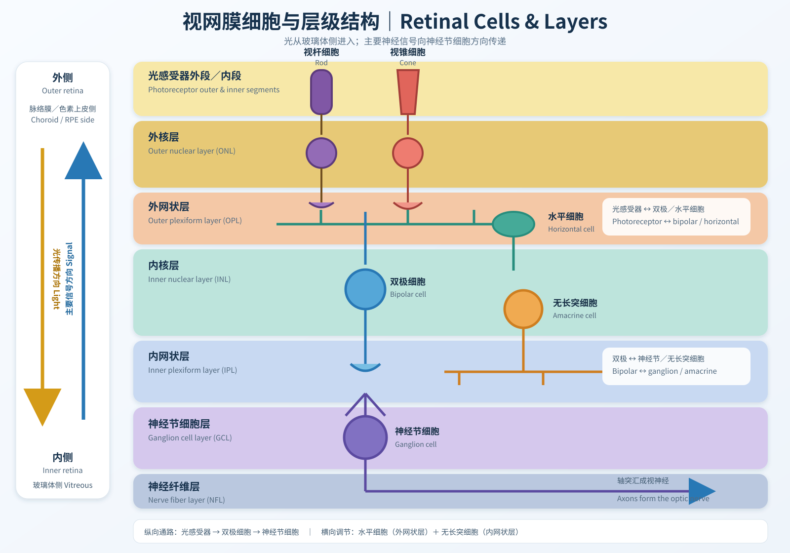

 You may find this in Chapter 9, exploring the brain/ Part V, Perception 25-29，This file is aim to explain retina circuitry

# 26 Visual Processing by Retina

Retina contains 3 Layers of cells:

 作者 OpenStax College - Anatomy &amp; Physiology, Connexions Web site. <a rel="nofollow" class="external free" href="https://cnx.org/content/col11496/1.6/">https://cnx.org/content/col11496/1.6/</a>, Jun 19, 2013.，<a href="https://creativecommons.org/licenses/by/3.0" title="Creative Commons Attribution 3.0">CC BY 3.0</a>，<a href="https://commons.wikimedia.org/w/index.php?curid=30148002">链接</a>

**Ganglion cell->Bipolar cell->Photoreceptor cell**

**There are two pathways that conveys visual information**
|Pathways|Formation|
|-|-|
|Direct pathway/Vertical pathway|Rod/cone -> Bipolar cells -> Ganglion cells|
|Indirect pathway/lateral pathway in inner retina| Photoreceptors <-> horizontal cells -> modulates photoreceptors -> bipolar cells|
|Indirect pathway/lateral pathway in outer retina| Bipolar cells -> amacrine cells -> modulates bipolar cells -> ganglion cells|

 # Photoreceptor
cells that "detect" light, color, respond to light with graded changes in membrane potential

 作者 Christine Blume, Corrado Garbazza &amp; Manuel Spitschan - Blume, C., Garbazza, C. &amp; Spitschan, M. Effects of light on human circadian rhythms, sleep and mood. Somnologie 23, 147–156 (2019). <a rel="nofollow" class="external free" href="https://doi.org/10.1007/s11818-019-00215-x">https://doi.org/10.1007/s11818-019-00215-x</a>，<a href="https://creativecommons.org/licenses/by/4.0" title="Creative Commons Attribution 4.0">CC BY 4.0</a>，<a href="https://commons.wikimedia.org/w/index.php?curid=97114926">链接</a>

 
 ## 2 types of Photoreceptors:Rods and Cones

**Rod**

 作者 <a href="https://en.wikipedia.org/wiki/" class="extiw" title="wikipedia:">英语维基百科</a>的<a href="https://en.wikipedia.org/wiki/User:Kosigrim" class="extiw" title="wikipedia:User:Kosigrim">Kosigrim</a> - 自己的作品，公有领域，<a href="https://commons.wikimedia.org/w/index.php?curid=33725653">链接</a>

**Cone**

 作者 <a href="//commons.wikimedia.org/wiki/User:Kruusam%C3%A4gi" title="User:Kruusamägi">Ivo Kruusamägi</a> - 自己的作品，<a href="https://creativecommons.org/licenses/by-sa/3.0" title="Creative Commons Attribution-Share Alike 3.0">CC BY-SA 3.0</a>，<a href="https://commons.wikimedia.org/w/index.php?curid=9772820">链接</a>

 
Differences between

|Rods视杆|Cones视锥|
|---|---|
|High sensitivity to light对光高敏感|Lower sensitivity低敏感|
|More visual pigment, capture more light更多视色素以捕捉光|Less visual pigment|更少的视色素
|specialized for night vision主要负责夜视|specialized for day vision负责日光|
|High amplification, single photon detection增强信号，可检测单个光子|Low amplification低增强|
|Low temporal resolution: slow response, long integration time低时间分辨力，整合时间长（整合每100ms内吸收的光子）|High temporal resolution: Fast response, short integration time高时间分辨力，整合时间短，更快回应|
|More sensitive to scattered light对点状光更敏感|Most sensitive to direct axial rays对光线敏感|
|Rod System|Cone System|
|Achromatic, due to only one kind of visual pigment(Rhodopsin) 只含有一种视色素（视紫红素）因此仅有单色视觉|Chromatic多色视觉|
|Low acuity: not present in fovea, highly convergent retinal pathways神经会聚程度高，聚集在周围视网膜（低分辨率）|concentrated in fovea, dispersed retinal pathways神经会聚程度低，聚集在中央凹（高分辨率）|

They respond to light by changing membrane potential.

 ## Photoreceptor: Reaction of photoreceptor cells under darkness/illumination

|Darkness|Illumination|
|---|---|
|Darkness **-->** Retinal bind with opsin，high cytoplasmic cGMP concentration **-->** cGMP-gated channel(CNG) open **-->** Na+,Ca2+ influx, K+ efflux(not through CNG) **-->** depolarization|**Stage 1**: Light **-->** retinal conformationally changed(11-cis to all-trans configuration, hydrolyzed) **-->** no longer bind with opsin->opsin conformationally changed( change to metarhodopsin II)|
|---|**Stage 2**: transducin activated cGMP phosphodiesterase（PDE）, hydrolyzing cGMP **-->** cGMP concentration ↓ |
|---|**Stage 3**: cGMP gated channel close **-->** cut down Na+ influx，K+ efflux continue **-->** hyper-polarization|

·Cones have a higher rate of retinal hydrolization, generation

##  Photoreceptor: Calcium and light adaption钙调节与明适应

Calcium modulate several proteins of phototransduction pathway, it inhibits guanylyl cyclase, the enzymes that synthesize cGMP
|Darkness|Illumination|
|---|---|
|Ca2+ constantly flows into the cell through opened CNG channel, it's been extruded by specialized Ca2+ carrier thus maintains a constant Ca2+ concentration|During illumination, Ca2+ influx is off but extrudation continues.|
|Inhibits guanylyl cyclase|Relieves the inhibition of guanylyl cyclase, cGMP concentration ↑ , CNG channel reopen|

·Lowering Ca2+ concentration is believed to speed up inactivation of the visual pigments, so that the effectiveness of light in activating cGMP phosphodiesterase is reduced.

·Because of the Ca2+ effect, a more intense stimulus(light) is required to close the same amount of CNG channel.（slowly adapt to current illumination)

·Calcium involved in releasing of glutamate. Ca2+ --> bind with synaptotagmin（突触结合蛋白） --> Relieve effectiveness of complexin in clamping SNARE protein --> SNARE protein catches synaptic vesicle and hold them in active zone --> vesicle membrane merge with the zone --> exocytosis, releasing glutamate .

Therefore, Glu concentration is related to the Ca2+ concentration

# Bipolar cell

## Two types of Bipolar cell

Each cone cells synapse on both 2 types of bipolar cell, it "communicates" with bipolar cells with glutamate(neurotransmitter)

|Cell type|Reaction to glutamate|
|---|---|
|On-center bipolarcell|inhibit|
|Off-center bipolarcell|excite|

|---|Ca2+ concentration|Glu concentration|Reaction of On-center bipolar cell|Reaction of Off-center bipolar cell|
|---|---|---|---|---|
|Illumination|↓|↓|Excited|Inhibited|
|Darkness|↑|↑|Inhibited|Excited|

# Ganglion cell

·Ganglion cells are able to initiate action potential
·Ganglion cells convey output of retina

## Two types of ganglion cells
·On-center ganglion cells
·Off-center ganglion cells
They bind with the same type of bipolar cells chemically(Glu) and electrically.

## The receptive field of ganglion cell has a center and an antagonistic surround

The receptive field of ganglion cell has two features:

 1.The receptive field is roughly circular;

 2.In most ganglion cells the receptive field is divided into two parts:

  - A circular zone at the center, called the receptive field center;
  - The remaining area of the field, called the surround

 **Ganglion cell respond optimally to differential illumination of the receptive field center and surround.**

 The appearance of an object depends principally on the contrast between it and its background, not the intensity of the light source. Ganglion cells are specialized for detecting contrast and rapid change in visual images.

 [Image 2, receptive field of ganglion cell]
 
|Cell type|Stimulus|Respond|
|-|-|-|
|On&Off center ganglion cells|/|roughly constant fire rate|
|On&Off center ganglion cells|Diffuse illumination|Both small responses|
|On-center ganglion cell|Central illumination|Excited, fire rate increases|
|On-center ganglion cell|Surround illumination|Inhibited, fire rate increases after stimulus removed|
|Off-center ganglion cell|Central illumination|Inhibited,fire rate increases after stimulus removed|
|Off-center ganglion cell|Surround illumination|Excited, fire rate increases|

(There are some ganglion cells that are neither On-center nor Off-center. For ex, they respond to changes in the overall luminance of the visual field and important in controlling pupil reflexes)

## Specialized ganglion cells processing different aspects of the visual images

In addition to the contrast and rapid change in visual images, the visual system also analyzes other aspect of the visual images, such as color, form, movements...

Each region of retina has several functionally distinct subsets of ganglion cells that conveys signals from photoreceptors, most ganglion cells in primate retina falls into two classes: M(Magno, large)-type ganglion cells and P(Parvo, small)-type ganglion cells, each class includes both on-center and off-center cells.

|Cell type|Characteristics|Function|
|-|-|-|
|M-type ganglion cells|Have large receptive field and large dendritic arbor| Analyses gross feature of a stimulus and its movement|
|P-type ganglion cells|More numerous|Selectively respond to specific wavelength (color)|
|Non M or P cells|Largely unknown |One type is respond to overall ambient light intensity|

# Interneurons

 作者 <a href="https://en.wikipedia.org/wiki/en:Henry_Vandyke_Carter" class="extiw" title="w:en:Henry Vandyke Carter">亨利·芬戴克·卡特</a> - <a href="https://en.wikipedia.org/wiki/Henry_Gray" class="extiw" title="en:Henry Gray">Henry Gray</a> (1918年) 《 Anatomy of the Human Body》 (See "图书" section below)<a href="https://en.wikipedia.org/wiki/Bartleby.com" class="extiw" title="en:Bartleby.com">Bartleby.com</a>: <a rel="nofollow" class="external text" href="http://www.bartleby.com/107/">Gray's Anatomy</a>, <a rel="nofollow" class="external text" href="http://www.bartleby.com/107/illus882.html">Plate 882</a>，公有领域，<a href="https://commons.wikimedia.org/w/index.php?curid=566821">链接</a>

## Horizontal cells

 -Have large dendritic trees, transfer information from distant cones to bipolar cells;

 -Horizontal cells electrically coupled with each other by gap junction therefore can relay informations between even farther photoreceptors contacting neighbored horizontal cells;

 -Feed back onto cones in the center of bipolar cells receptive field.

 ## Amacrine cells

 -Have no distinct long axon in most cases; their dendrite-like processes extend laterally within the inner plexiform layer.

 -Receive input mainly from bipolar cells and provide output to bipolar-cell terminals, ganglion cells, and other amacrine cells.

 -Shape the spatial and temporal properties of ganglion-cell responses, including center–surround organization, contrast sensitivity, response duration, motion detection, and direction selectivity.

-Some amacrine cells are electrically coupled by gap junctions; for example, AII amacrine cells are important for transmitting rod signals into cone bipolar pathways under dim light.
